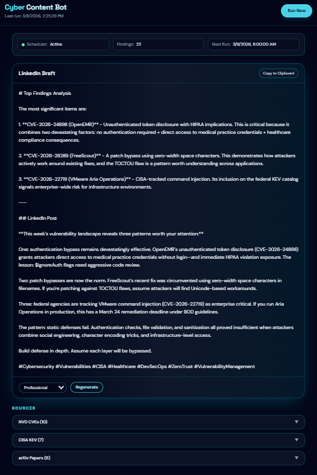

# Cyber Content Bot

A cybersecurity content automation tool that aggregates CVEs, CISA advisories, and AI security research — then uses Claude to draft LinkedIn posts for review.



## Features

- **Automated Data Collection** — Pulls high-severity CVEs, actively exploited vulnerabilities, and cutting-edge AI security research from three authoritative sources
- **AI-Powered Drafting** — Claude Haiku generates concise, professional LinkedIn posts from raw findings
- **Tone Control** — Regenerate drafts in professional, conversational, or technical tones
- **One-Click Manual Runs** — Trigger the pipeline on demand from the dashboard
- **Dark-Themed Dashboard** — React + Tailwind UI for reviewing drafts, browsing raw findings, and copying posts to clipboard
- **CI/CD Security Pipeline** — GitHub Actions runs Bandit SAST, pip-audit, and Gitleaks on every push

## Data Sources

| Source | What It Fetches | Filter |
|--------|----------------|--------|
| [NVD API](https://nvd.nist.gov/) | CVEs from the past 7 days | CVSS ≥ 7.0 (HIGH / CRITICAL), top 10 by score |
| [CISA KEV](https://www.cisa.gov/known-exploited-vulnerabilities-catalog) | Known Exploited Vulnerabilities | Added in the past 7 days |
| [arXiv](https://arxiv.org/) | AI security research papers | Keywords: LLM, prompt injection, AI security |

## Project Structure

```
cyber-content-bot/
├── app.py                        # Flask API server (port 5058)
├── render.yaml                   # Render deployment blueprint
├── requirements.txt              # Python dependencies
├── .env.example                  # Environment variable template
│
├── fetchers/
│   ├── nvd.py                    # NVD CVE fetcher
│   ├── cisa.py                   # CISA KEV fetcher
│   └── arxiv.py                  # arXiv paper fetcher
│
├── generator/
│   └── post_generator.py         # Claude Haiku post generation
│
├── client/                       # React + Vite frontend
│   ├── index.html
│   ├── vite.config.ts            # Vite config with Tailwind + API proxy
│   ├── src/
│   │   ├── App.tsx               # Dashboard UI
│   │   ├── api.ts                # Typed API client
│   │   ├── index.css             # Tailwind base styles
│   │   └── main.tsx              # React entry point
│   └── public/
│       └── favicon.svg           # Custom shield-and-lock icon
│
└── .github/
    └── workflows/
        └── security.yml          # Bandit, pip-audit, Gitleaks CI
```

## Quick Start

### Prerequisites

- Python 3.10+
- Node.js 18+
- An [Anthropic API key](https://console.anthropic.com/)

### Backend

```bash
# Create and activate a virtual environment
python -m venv .venv
# Windows
.venv\Scripts\activate
# macOS / Linux
source .venv/bin/activate

# Install dependencies
pip install -r requirements.txt

# Configure your API key
cp .env.example .env
# Edit .env and paste your Anthropic API key

# Start the Flask server
python app.py
```

The backend runs on **http://localhost:5058**. Click **Run Now** in the dashboard to fetch data and generate your first draft.

### Frontend

```bash
cd client
npm install
npm run dev
```

The Vite dev server starts on **http://localhost:5173** and proxies all `/api` requests to the Flask backend.

## API Endpoints

| Method | Endpoint | Description |
|--------|----------|-------------|
| `GET` | `/api/status` | Last run time, finding count, cycle status |
| `POST` | `/api/run` | Manually trigger a fetch + generate cycle (409 if already running) |
| `GET` | `/api/draft` | Current draft text and raw findings from all sources |
| `POST` | `/api/draft/regenerate` | Re-generate the draft — accepts `{ "tone": "professional" \| "conversational" \| "technical" }` |

## Configuration

| Variable | Required | Description |
|----------|----------|-------------|
| `ANTHROPIC_API_KEY` | Yes | Your Anthropic API key for Claude Haiku |
| `FLASK_DEBUG` | No | Set to `1` to enable Flask debug mode (defaults to off) |
| `VITE_API_BASE` | No | Backend API URL for production builds (e.g. `https://cyber-content-bot-api.onrender.com/api`). Falls back to `/api` for local dev |

Copy `.env.example` to `.env` and add your key. The app uses `python-dotenv` with `override=True` so the `.env` file always takes precedence over shell environment variables.

## How It Works

1. Click **Run Now** from the dashboard to trigger a fetch + generate cycle
2. The bot fetches from all three data sources (NVD, CISA, arXiv)
3. Findings are passed to Claude Haiku, which drafts a 150–250 word LinkedIn post highlighting the 2–3 most notable items
4. The dashboard polls `/api/status` while a cycle is running, then loads the draft when complete
5. Review the draft, regenerate with a different tone, or copy to clipboard

## CI/CD

The GitHub Actions workflow (`.github/workflows/security.yml`) runs on every push and PR to `main`:

- **Bandit** — Static analysis for Python security issues (HIGH severity)
- **pip-audit** — Checks dependencies against known vulnerability databases
- **Gitleaks** — Scans for accidentally committed secrets and API keys

### Security Fix: B201 — Flask Debug Mode

Bandit flagged a high-severity issue ([B201](https://bandit.readthedocs.io/en/latest/plugins/b201_flask_debug_true.html)) where `debug=True` was hardcoded in `app.run()`. Running Flask with debug mode enabled exposes the Werkzeug debugger, which allows arbitrary code execution on the server.

**Fix:** The debug flag now reads from the `FLASK_DEBUG` environment variable and defaults to **off**. Local developers can set `FLASK_DEBUG=1` in their `.env` file to re-enable it during development.

### Security Fix: Vulnerable Dependencies

pip-audit flagged 6 known vulnerabilities across 3 packages. All were resolved by bumping to patched versions:

| Package | Old | New | CVEs |
|---------|-----|-----|------|
| flask | 3.1.0 | 3.1.3 | CVE-2025-47278, CVE-2026-27205 |
| flask-cors | 5.0.1 | 6.0.0 | CVE-2024-6866, CVE-2024-6844, CVE-2024-6839 |
| requests | 2.32.3 | 2.32.4 | CVE-2024-47081 |

### Change: APScheduler Removed

The project originally used APScheduler to run a weekly fetch + generate cycle every Monday at 8 AM, with an automatic run on startup. This was removed in favour of manual-only triggering via the **Run Now** button. The `scheduler.py` file was deleted and `apscheduler` was removed from `requirements.txt`, reducing the dependency footprint and giving users full control over when the pipeline runs.

## Deployment (Render)

The project includes a `render.yaml` blueprint for one-click deployment to [Render](https://render.com):

| Service | Type | What It Does |
|---------|------|--------------|
| **cyber-content-bot-api** | Python Web Service | Flask backend on port 5058 |
| **cyber-content-bot-ui** | Static Site | React frontend built from `client/dist` |

To deploy:

1. Push the repo to GitHub
2. Go to [Render Dashboard](https://dashboard.render.com/) → **New** → **Blueprint**
3. Connect your repo — Render reads `render.yaml` automatically
4. Set `ANTHROPIC_API_KEY` when prompted for the backend
5. Set `VITE_API_BASE` to the backend's public URL + `/api` (e.g. `https://cyber-content-bot-api.onrender.com/api`) for the frontend

## Tech Stack

| Layer | Technology |
|-------|------------|
| Backend | Python, Flask, Flask-CORS |
| Data Fetching | Requests, Feedparser |
| AI Generation | Anthropic SDK (Claude Haiku) |
| Frontend | React 18, TypeScript, Vite |
| Styling | Tailwind CSS v4 |
| CI/CD | GitHub Actions |
| Hosting | Render |

## License

This project is licensed under the MIT License — see the [LICENSE](LICENSE) file for details.
